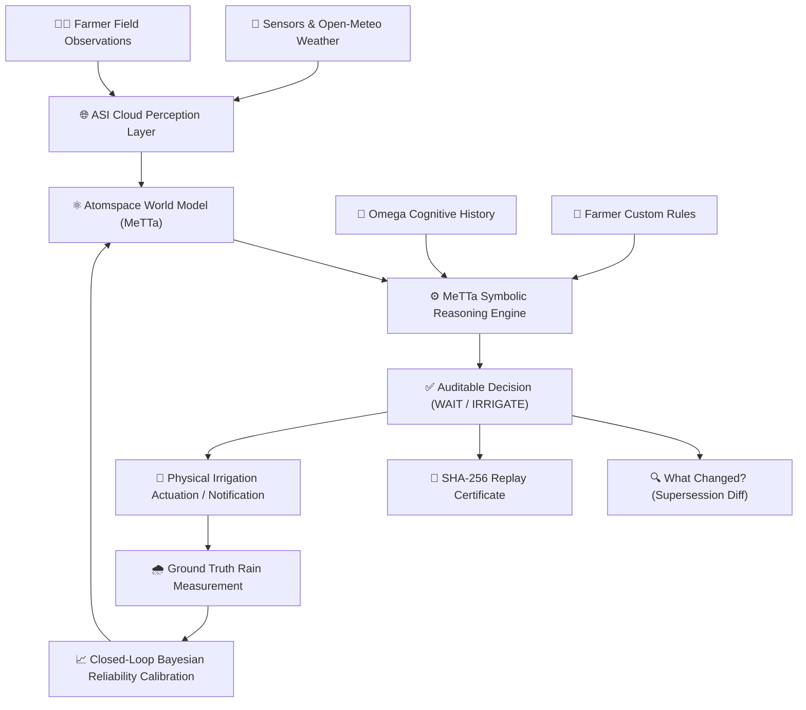

# 🌾 AgriGuide — Explainable Agricultural Decision Agent

**Track**: Solo Track $\rightarrow$ Omega Track: *One Agent Producing an Auditable Decision*  
**Builder**: Edwin Mwiti (Nexora AI)  
**Hackathon**: SingularityNET / BASIX Omniversity Hackathon (2026)  

---

### 🌐 Live Deployments & Verification

| Service | Platform | Live URL | Status |
| :--- | :--- | :--- | :--- |
| **Frontend Web App** | **Vercel** | [https://agriguide-zeta.vercel.app](https://agriguide-zeta.vercel.app) | 🟢 **Live & Operational** |
| **Backend API & Swagger** | **Render** | [https://agriguide-backend-1rtz.onrender.com/docs](https://agriguide-backend-1rtz.onrender.com/docs) | 🟢 **Live & Operational** |
| **API Health Endpoint** | **Render** | [https://agriguide-backend-1rtz.onrender.com/](https://agriguide-backend-1rtz.onrender.com/) | 🟢 **200 OK** |
| **GitHub Repository** | **GitHub** | [https://github.com/Edwin420s/AgriGuide](https://github.com/Edwin420s/AgriGuide) | 🟢 **Public & Auditable** |

---

### 🔑 Instant Demo & Testing Credentials

| Role | Email | Password | Access Type |
| :--- | :--- | :--- | :--- |
| **Administrator** | `eduedywn5@gmail.com` | `AdminPassword123!` | Full multi-farmer fleet management, sensor diagnostics, and audit inspector |
| **Demo Farmer** | `demo.farmer@agriguide.io` | `DemoPassword123!` | Kirinyaga maize & French beans field twins, live weather, and MeTTa decision engine |

> **Tip**: You can use the **"⚡ Admin Quick Login"** or **"⚡ Demo Farmer Quick Login"** buttons directly on the login page to authenticate instantly with one click.

---

## 💡 Executive Summary

Smallholder farmers cannot afford ungrounded black-box recommendations. When a farmer asks *"Should I irrigate today?"*, an ordinary LLM might hallucinate a plausible answer, but it cannot guarantee water conservation, respect physical soil dynamics, or provide a deterministic mathematical proof.

**AgriGuide** solves this by separating **neural perception** from **symbolic reasoning**:
1. **Sensory Perception**: SingularityNET / ASI Cloud models parse noisy natural language observations and farmer field notes into structured facts.
2. **Symbolic Decision Core**: Grounded in **MeTTa** declarative rules and the stateful **Omega** cognitive architecture. Recommendations (`IRRIGATE`, `WAIT`, `MONITOR`) are evaluated against explicit soil physics (FAO-56 Penman-Monteith ET0, crop coefficients, and depletion envelopes).
3. **Auditability & Replay**: Every decision generates a step-by-step symbolic derivation proof and a tamper-proof **SHA-256 Replay Certificate** for reproducible verification.
4. **Decision Supersession ("What Changed?")**: When new evidence arrives (e.g. storm clouds gather or a sensor spikes), the agent does not overwrite history. It links decisions in a cognitive supersession graph and shows the farmer exactly what changed.
5. **The Agent That Grows Up**: Farmers can teach the agent custom agronomic rules (e.g., *"In sandy loam during flowering, pause irrigation if rain $\ge$ 65%"*), dynamically compiling them into active MeTTa rewrite rules.

---

## 🌾 The Cognitive Loop

```
Evidence → Belief → World State → Omega Memory → MeTTa Reasoning → Decision → Audit → Outcome → Learning → State Revision
```



---

## 🎓 BASIX MeTTa Omniversity Training Lineage

AgriGuide directly implements and scales the core concepts taught in the **BASIX MeTTa Curriculum**:

| Curriculum Module | Core Concepts & Challenges | Direct Implementation in AgriGuide |
| :--- | :--- | :--- |
| **Module 1: Foundations** | • Syntax, Types & S-Expressions<br>• Pattern Matching Logic (`match &self`)<br>• Challenges 1–3: Accumulators (`sumIf`) | • Typed ontology in `metta/knowledge/agriculture.metta`<br>• Pattern matching over dynamic field states<br>• `sum-active-water-demand` higher-order accumulation |
| **Module 2: Advanced Logic** | • Relational KBs (Challenge 4)<br>• Python Interop `py-atom` (Challenge 5)<br>• Range Guards & Transformers (Challenges 7–9) | • Digital twin knowledge graph (`world_model.py`)<br>• `hyperon.MeTTa()` runner integration (`metta_runner.py`)<br>• Agronomic safe root-zone moisture stress envelopes |
| **Module 3: Non-Determinism** | • Space manipulation (`add-atom`, `remove-atom`)<br>• Missing lead investigation (Challenge 15)<br>• Non-deterministic `superpose` (Challenge 16) | • Testing temporary hypothesis leads in Atomspace<br>• Counterfactual reasoning branches (`if_irrigate` vs `if_wait`)<br>• Recursive hydrological runoff path tracing |
| **Module 4: Integration & MORK** | • Self-rewriting rules & Unification (Lesson 21)<br>• Query Parsing (`metta-demo` / `movie-recommender`)<br>• End-to-end question answering pipeline | • "The Agent That Grows Up": Dynamic farmer custom rules<br>• Structured evidence extraction from natural language<br>• SingularityNET ASI Cloud OpenAI-compatible task routing |

---

## 🚀 Key Capabilities

- **Symbolic MeTTa Runtime**: Evaluates declarative S-expressions natively with Atomspace pattern matching, unification, and typed declarative predicates.
- **MeTTa Counterfactual Analysis**: Evaluates candidate branches (`IRRIGATE` vs `WAIT`), computing comparative efficiency, risk factors, and water-loss assessments.
- **Decision Supersession ("What Changed?")**: Visually contrasts superseded recommendations side-by-side when new evidence updates field beliefs.
- **"The Agent That Grows Up"**: Farmers can create custom rules in natural language or structured constraints, compiling directly into MeTTa rules.
- **FAO-56 Agronomic Intelligence**: Integrates Penman-Monteith reference evapotranspiration (ET0), crop coefficients (Kc), and sensor flatline/spike anomaly detection.
- **Closed-Loop Learning**: Updates sensor and forecast reliability weights based on verified ground-truth rainfall measurements.
- **Deterministic Guardrails**: Independent valve lockouts, maximum duration clamps, and reservoir depletion ceilings that override any model hallucinations.

---

## 🧪 Verification & Benchmark Suite

The codebase has undergone automated verification across unit, integration, and curriculum tests:

```bash
# Automated Test Suite (66/66 Passing)
pytest backend/tests/ -q
# Result: 66 passed in 26.68s (100% success rate)

# BASIX MeTTa Curriculum & 10-Point Scientific Benchmark
python3 scripts/verify_metta_curriculum.py
# Result: ALL 6 MODULES VERIFIED & 10/10 SCIENTIFIC BENCHMARKS PASSED
```

### Scientific Benchmarks (10/10)
- ✅ Critically Dry Field + Low Rain Outlook (Evidence Reasoning)
- ✅ Sensor vs Satellite Telemetry Divergence (Conflict Resolution)
- ✅ Unphysical Telemetry Leap Spike (18% $\rightarrow$ 91%) (Sensor Quality)
- ✅ Stuck Frozen Telemetry Line (Sensor Quality)
- ✅ Irrigate vs Wait Trade-Off Matrix (Counterfactual Reasoning)
- ✅ Duration Safety Ceiling Clamping (60m $\rightarrow$ 30m) (Safety & Guardrails)
- ✅ Physical Valve Lockout when Water Unavailable (Safety & Guardrails)
- ✅ Leaching Prevention Under Heavy Rain (Agronomic Domain: Fertilizer)
- ✅ Seedbed Too Dry For Germination (Agronomic Domain: Planting)
- ✅ Physiological Maturity & Dry Field Window (Agronomic Domain: Harvest)

---

## 🛠 Tech Stack

- **Frontend**: React 18, Vite, TypeScript, Tailwind CSS, Lucide Icons (Deployed on **Vercel**)
- **Backend API**: Python 3.11, FastAPI, SQLAlchemy, Pydantic, Uvicorn (Deployed on **Render**)
- **Symbolic AI**: MeTTa / Hyperon S-Expression Engine (`metta/`), Atomspace Knowledge Graph
- **Cognitive Orchestration**: Omega Agent State Machine (`backend/app/services/omega.py`)
- **Neural Perception**: SingularityNET / ASI Cloud OpenAI-compatible LLM adapter (`backend/app/services/llm.py`)
- **Deployment**: Multi-stage Docker container with dynamic `$PORT` routing and automated SQLite seed migrations

---

## 💻 Local Development

### 1. Backend Setup
```bash
# Clone the repository
git clone https://github.com/Edwin420s/AgriGuide.git
cd AgriGuide

# Install dependencies and start FastAPI backend
pip install -r backend/requirements.txt
python3 -m uvicorn backend.app.main:app --host 0.0.0.0 --port 8000
```
Backend API will be accessible at `http://localhost:8000` (Swagger UI at `/docs`).

### 2. Frontend Setup
```bash
# In a new terminal window:
cd frontend
npm install
npm run dev
```
Open `http://localhost:5173` in your browser.

### 3. Docker Compose
```bash
docker compose up --build
```
Access frontend at `http://localhost:5173` and backend at `http://localhost:8000`.

---

## 📄 Key Documentation & Deliverables

- **[AI Disclosure Statement](AI_DISCLOSURE.md)**: Full declaration of AI tooling assistance and human authorship.
- **[Cloud Deployment Guide](DEPLOYMENT.md)**: Detailed deployment specifications for Vercel, Render, Railway, and Fly.io.
- **[Sample Reasoning Transcript](docs/sample_reasoning_transcript.md)**: Full MeTTa proof derivation & Omega memory trace.
- **[Architecture Specification](docs/architecture.md)**: Complete system design and neural-symbolic separation model.
- **[Omega Integration Spec](docs/omega-integration.md)**: Cognitive history, episodic states, and supersession links.
- **[FAO-56 Agronomic Spec](docs/FAO56_PENMAN_MONTEITH_SPEC.md)**: Evapotranspiration physics and sensor quality controls.

---

## ⚖️ AI Disclosure Statement (Summary)

> In strict adherence to the BASIX Omniversity Hackathon Solo Track rules:
>
> - **Google Antigravity Agentic Assistant** was utilized for code scaffolding, type definitions, test suite generation, and frontend component modularization.
> - **Human Author & Domain Engineering**: All domain knowledge models, agricultural decision heuristics (loam soil moisture thresholds, flowering stage water demand, reservoir constraints), MeTTa S-expression syntax design, and database schema architectures were authored, verified, and directed by Edwin Mwiti (Nexora AI).
> - **Zero Black-Box LLM Hallucinations in Reasoning**: The core decision boundaries and counterfactual derivations are evaluated deterministically using MeTTa S-expression rewrite rules (`(= (agriguide-decision ...) ...)`) and the Omega agent runtime, rather than presenting ungrounded LLM completions as the decision engine.
