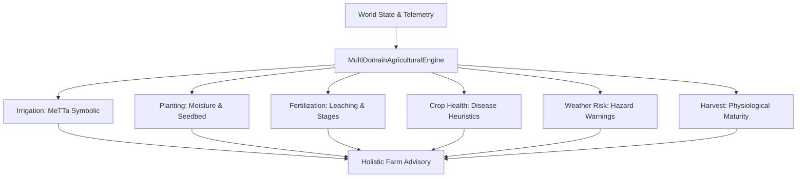

# Multi-Domain Agricultural Engine Architecture

## Overview
AgriGuide's agricultural intelligence platform extends symbolic reasoning beyond single-domain irrigation into a holistic multi-domain agronomic evaluation system. Rather than treating decisions in isolation, the `MultiDomainAgriculturalEngine` cross-evaluates six primary domains:

1. **Irrigation Reasoning**: Soil moisture vs. crop demand vs. imminent precipitation.
2. **Planting Optimization**: Soil seedbed readiness, temperature windows, and germination moisture.
3. **Fertilization & Nutrients**: Leaching risk mitigation, vegetative stage timing, and osmotic burn prevention.
4. **Crop Health & Disease**: High-humidity fungal spore thresholds, heat shock, and vigor anomalies.
5. **Weather & Climate Risks**: Wind drift limits, storm lodging hazards, and extreme frost protection.
6. **Harvest Timing**: Physiological maturity, grain moisture dry-down, and pre-harvest wet rot avoidance.

## Data Flow Diagram

## Domain Decisions Schema
Every domain decision is represented as a structured object:
- `domain`: Name of the agricultural domain.
- `recommendation`: Concrete actionable status (`APPLY_FERTILIZER`, `DELAY_PLANTING`, `HARVEST`, etc.).
- `confidence`: Calibrated probability (0.0 to 1.0).
- `reason`: Grounded explanation referencing physical observations.
- `rules`: Identifiers of all symbolic rules triggered.
- `steps`: Step-by-step reasoning chain with inputs and outputs.
- `action_params`: Safe physical bounds for field actuation.
- `counterfactuals`: Alternative branch exploration.
